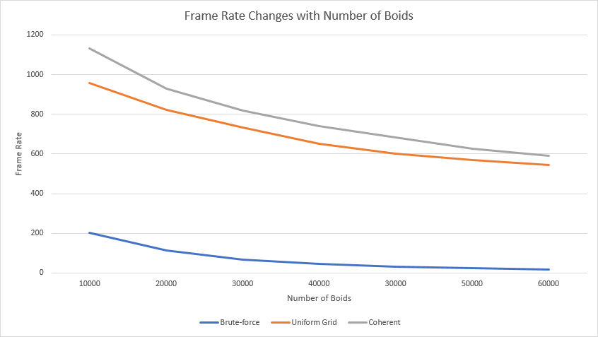
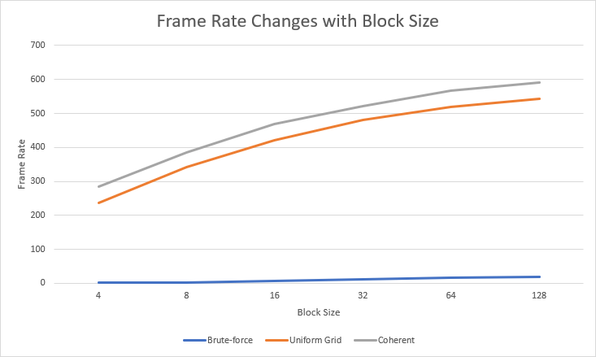
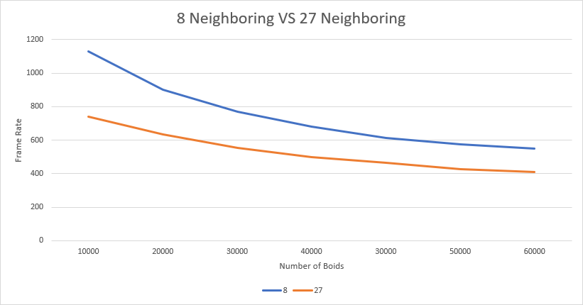

**University of Pennsylvania, CIS 565: GPU Programming and Architecture,
Project 1 - Flocking**

* Jizhou Yan	
* Tested on: Windows 10, i7-4789K @ 4.00GHz 32GB, GTX 1080Ti(Personal Desktop)

## Result 

Parameters for above simulation:

* Number of boids = `60000`
* dT = `0.2`
* Resolution = `2560*1440`
* Coherent Uniform Grid
* BlockSize = `128`
* Scene Scale = `100`
* Rule 1 Distance = `5.0`
* Rule 2 Distance = `3.0`
* Rule 3 Distance = `5.0`
* Rule 1 Scale = `0.01`
* Rule 2 Scale = `0.1`
* Rule 3 Scale = `0.1`

## Performance Analysis

I choose to use 1st method : Disable visualization (#define VISUALIZE to 0 ) to measure performance. Parameters used in analysis remain the same as overview if not explicitly specified.

#### Frame-rate vs Number of Boids

The frame-rate of three different algorithms (`Brute Search`, `Uniform Grid` and `Coherent Uniform Grid`) vs number of boids:

#### Frame-rate vs vs Block Size  
The frame-rate of three different algorithms vs different block size:

#### 8 Neighboring vs 27 Neighboring  
The frame-rate of 8 Neighboring and 27 Neighboring:

## Answers to Questions 
* For each implementation, how does changing the number of boids affect performance?
	* As indicated in section **Frame-rate vs Number of Boids**, for Brute Search: frame-rate decreases significantly with the increase of number of boids. 
	* For Uniform Grid and Coherent Uniform Grid, they still remain interactive when number of boids reaches 100,000. But Coherent Uniform Grid has better performance than Uniform Grid. 

* For each implementation, how does changing the block count and block size affect performance?
	* For each implementation, if block size is pretty small (like 4 or less), the performance will be devastated. With the increase of block size , the performance will be improved too. But with the increase of block size, the improvement of performance will be less obvious. So I think this is a trade-off, the key is how to choose a block size number that is not too low to share memory for different threads. But much higher block size is not necessary. Too small block size will make the hit-rate of shared-memory within a GPU block pretty small, which will introduce frequent memory operations and reduce the performance. 

* For the coherent uniform grid: did you experience any performance improvements with the more coherent uniform grid? Was this the outcome you expected?
	* Yes. According to **Averaged runCUDA() Elapsed Time vs Number of Boids**, Coherent Uniform Grid **did** perform better than basic Uniform Grid implementation, which was the same as I expected. After re-shuffling the `pos` and `vel` arrays of particle, the data will be more consistent and continuous in memory. "Consistent and continuous" means that physically adjacent threads (continuous thread indices) on GPU will be likely to access the same location of memory since they are likely to locate in the same grid cell. And the information of boids in the same grid cell are re-shuffled to make them continuous in memory, so there will be performance improvement for Coherent Uniform Grid. Performance will be improved from more continuous data structure in memory on GPU, which will increase the memory hit-rate within a block size where the threads are physically adjacent.

* Did changing cell width and checking 27 vs 8 neighboring cells
	* Intuitively, we know that checking more cells than is necessary will negatively affect performance. Given that the grid cell size is two times the neighborhood distance, in three dimensions, only 8 grid cells even need to be checked. However, with the number of boids increasing, the speed difference become smaller.